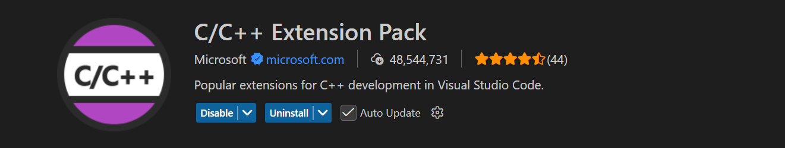
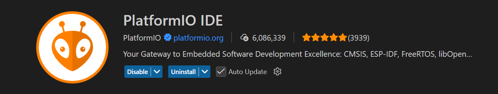
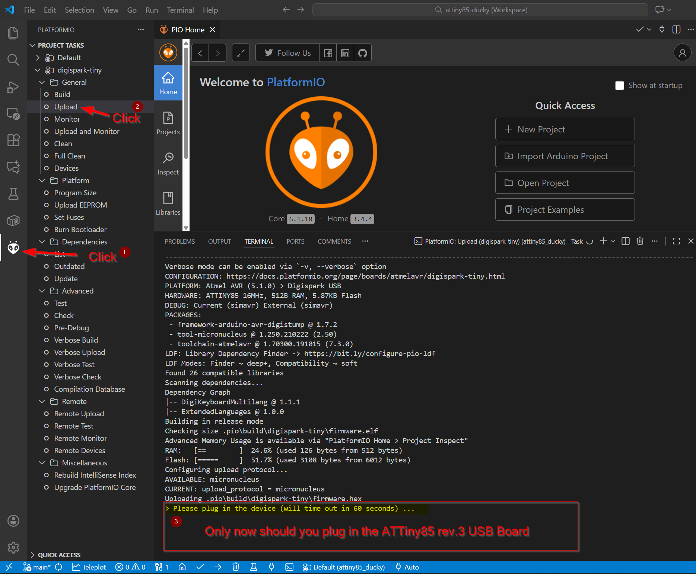
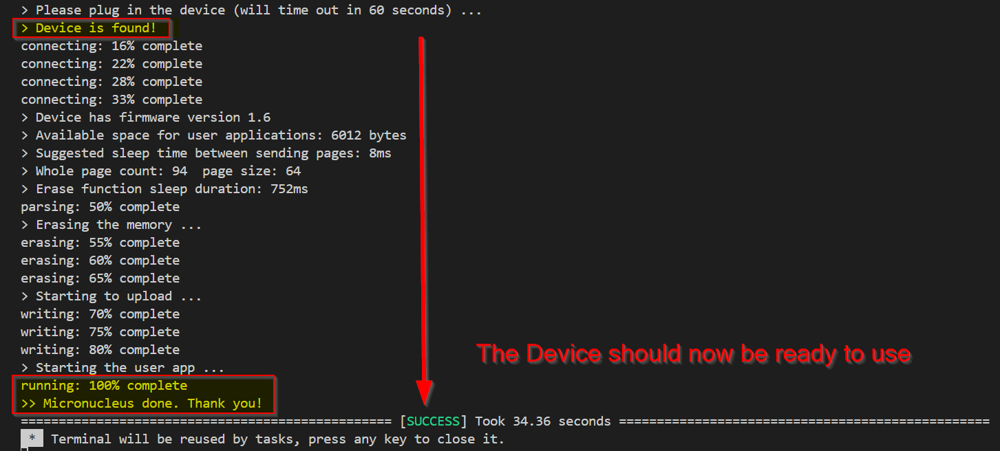

# ATTiny85 Ducky

### A Cheap Disposable Alternative to the Hak5 USB RubberDucky

This Platformio Project Repository utilizes the [AZ-Delivery ATTiny85 Digispark Rev.3 Kickstarter](https://www.az-delivery.de/en/products/digispark-board) as a USB RubberDucky-like device capable of executing pre-programmed keystroke injection attacks. It leverages the DigiKeyboardMultilang library to simulate keyboard inputs, allowing for versatile payload delivery.


### Be sure to test your payloads in a safe and legal environment!

# Disclaimer
This project is intended for authorised securitz testing and educational purposes only. Unauthorized use of this device on systems without explicit permission is illegal and unethical. The author does NOT endorse and is NOT responsible for any misuse or damage caused by improper use of the code and examples in this project.


## Features
- Utilizes the DigiKeyboardMultilang library for multi-language keyboard support.
- **ExtendedLanguages library** - Custom library that extends DigiKeyboardMultilang with additional keyboard layouts for German, French, and Greek Keyboards
- **Example Payloads** - Pre-configured examples in the `examples/` directory.
- **Simple setup and programming process** using the PlatformIO project environment provided.

## Getting Started
1. Clone this repository to your local machine.

```
git clone https://github.com/yourusername/attiny85_ducky.git

```


2. Open the included project workspace file `attiny85_ducky.code-workspace` in [Visual Studio Code](https://code.visualstudio.com/).

```
cd attiny85_ducky
code .vscode/attiny85_ducky.code-workspace
```

3. Install the [C/C++ Extension Pack](https://marketplace.visualstudio.com/items?itemName=ms-vscode.cpptools-extension-pack) and [PlatformIO IDE VS Code Extension](https://marketplace.visualstudio.com/items?itemName=platformio.platformio-ide) if you haven't already. (see: [PlatformIO Intsall Guide](https://platformio.org/install/ide?install=vscode)





4. It is recommended to try out the default payload first to check that everything is working. This is in the `src/main.cpp` file by default and opens the GitHub project URL in the default browser. this is that same payload provide in the `examples/DemoOpenProjectRepo/` directory.

5. Once the demo payload was successful, you should then proceed to modify the payload or try out other example payloads provided in the `examples/` directory. The simplest way to do this is to copy the `main.cpp` file from the example folder you want to try into the `src/` directory, replacing the existing `main.cpp` file. When developing your own payloads, you can refer to the example payloads for guidance, but should start by modifiying the lines afther the commend line `// --- THE HID INJECTION STARTS HERE ---` to create the loging of your HID injection commands. custom values such as string parameters can be set in the top of the file. e.g. `const char* runCmdPld = "https://youtu.be/Hy8kmNEo1i8";` or `cmd.exe /c netsh wlan show profile` etc.

6. In the PlatformIO toolbar, click the `build` button to ensure that the build works and does an auto-setup / download of the **digispark-tiny** and **DigiKeyboardMultilang** code to the `.pio` directory in the project.


7. ONLY IF build says it `SUCCESS`, proceed to try uploading: 
IMPORTANT!: `Disconnect the DigiSpark ATTiny85 device`, the without anything plugged in using the `upload` button in the PlatformIO toolbar. 


8. You have 60 seconds to connect the device where its bootloader is listening for upload.


9. Once uploaded, the device will execute the pre-programmed payload when plugged into a target machine. The default provided and all the example payloads are designed for Windows systems and will pause for 6 seconds to allow the OS to recognize the device and auto-install any required drivers before executing the payload. If you don'y want to execute the payload immediately, you simply need to unplug it within 6 secomd of the RED LED lighting up.
7. 

## Customization
To customize the payload, modify the `setup()` and `loop()` functions in `src/main.cpp`. 

In addition to the 6 second delay before payload execution, you can also add your own delays in the payload code itself using `keyboard.delay(ms);` where `ms` is the number of milliseconds to wait.


-----
## Simple Example Payload to execute a ScattRoll URL on Windows:

Modify the `src/main.cpp` file as follows:

```cpp
#include <Arduino.h>
#include <DigiKeyboardMultilang.h>
#include <extendedLanguages.h> // Include ExtendedLanguages for additional layouts

DigiKeyboardMultilang keyboard(lang_de); // Use lang_de for German QWERTZ layout (or lang_us for US English)

const char* runCmdPld = "https://youtu.be/Hy8kmNEo1i8"; // ScattRoll URL Example

int redLED = 1;

void setup() {
    pinMode(redLED, OUTPUT); // Initialize the RED LED pin as an output
    digitalWrite(redLED, HIGH); // Turn on the RED LED while executing payload
    
    // --- THE HID PAYLOAD STARTS HERE ---
    keyboard.delay(5000); // Wait 5 seconds to allow the OS to recognize the device
    keyboard.sendKeyStroke(KEY_R, 0x08); // Win+R (0x08 = Left GUI/Windows key modifier)
    keyboard.delay(800); // Wait 0.8 seconds for the run dialog to open
    keyboard.println(runCmdPld); // Open a ScattRoll URL in the run dialog
    keyboard.delay(3000); // Wait 3 seconds for the browser to open
    keyboard.println("f");// YouTube fullscreen shortcut key = 'f'
    // --- THE HID PAYLOAD ENDS HERE ---
    
    digitalWrite(redLED, LOW); // Turn off the RED LED after executing payload
}

void loop() {
    // the loop function is intentionally left empty But if you want to repeat the payload,
    // you can add code here with your desired logic and delays instead of in setup().
}
```

Further inspriation for creating your payloads can be found in the `./examples/` directory included with this project. 

Else you can alternatively check out the preexisting ones made available already by [**CedArctic** in the **DigiSpark-Scripts** repo](https://github.com/CedArctic/DigiSpark-Scripts). 


**Available Keyboard Layouts:**
- `lang_us` - US English (from DigiKeyboardMultilang)
- `lang_de` - German QWERTZ (from ExtendedLanguages) ✅ **TESTED & WORKING with the examples provided**
- `lang_fr` - French AZERTY (from ExtendedLanguages)
- `lang_gr` - Greek (from ExtendedLanguages)
- More layouts available in the DigiKeyboardMultilang library documentation

### Be sure to test your payloads in a safe and legal environment!

## Disclaimer
This project is intended for educational purposes only. Unauthorized use of this device on systems without explicit permission is illegal and unethical. The author is not responsible for any misuse or damage caused by this project.

