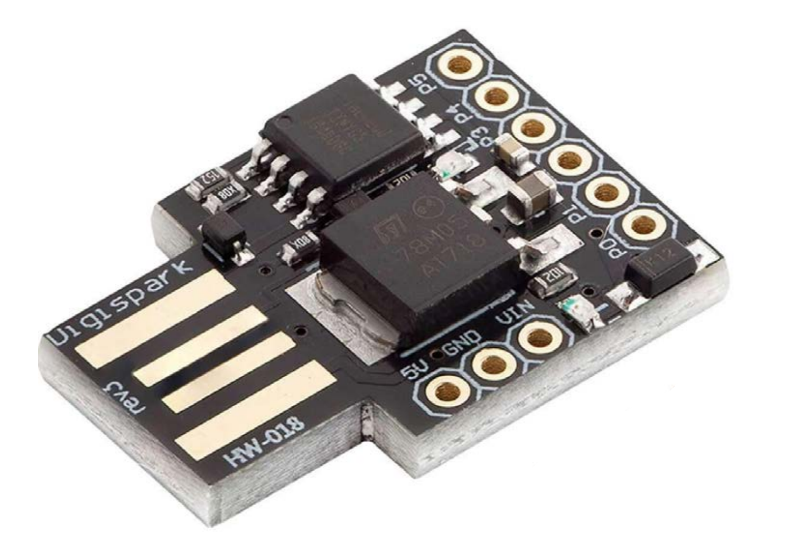

# ATTiny85 Ducky

### A Cheap Disposable Alternative to the Hak5 USB RubberDucky

This Platformio Project Repository utilizes the [AZ-Delivery ATTiny85 Digispark Rev.3 Kickstarter](https://www.az-delivery.de/en/products/digispark-board) as a USB RubberDucky-like device capable of executing pre-programmed keystroke injection attacks. It leverages the DigiKeyboardMultilang library to simulate keyboard inputs, allowing for versatile payload delivery.



## Features
- Utilizes the DigiKeyboardMultilang library for multi-language keyboard support.
- **ExtendedLanguages library** - Custom library that extends DigiKeyboardMultilang with additional keyboard layouts:
  - ✅ **German (QWERTZ)** - Full support including umlauts (ä, ö, ü, ß) and AltGr combinations
  - ✅ **French (AZERTY)** - Full AZERTY layout with French special characters
  - ✅ **Greek** - Greek keyboard layout for Latin character input
  - More layouts coming soon...
- Simple setup and programming process using the PlatformIO project environment provided.
- **Example Payloads** - Pre-configured examples in the `examples/` directory:
  - `YTRoll/main.cpp` - YouTube RickRoll payload with fullscreen

## Roadmap
- [x] ~~Add support for German keyboard layout~~ ✅ **COMPLETED**
- [x] ~~Add support for French keyboard layout~~ ✅ **COMPLETED**
- [x] ~~Add support for Greek keyboard layout~~ ✅ **COMPLETED**
- [x] ~~Create example payloads (YTRoll)~~ ✅ **COMPLETED**
- [x] ~~Clean up incorrect upstream library files~~ ✅ **COMPLETED**
- [ ] Add support for additional keyboard layouts (Spanish, Italian, Portuguese, etc.)
- [ ] Include more complex payload examples (credential harvesting, reverse shell, etc.)
- [ ] Include customizable micronucleus bootloader with modifiable USB VID/PID & vendor/device names for increased compatability to auto run with stealth.

## Getting Started
1. Clone this repository to your local machine.
3. Open the included project workspace file `attiny85_ducky.code-workspace` in Visual Studio Code.
3. Install the PlatformIO extension if you haven't already. (https://platformio.org/install/ide?install=vscode)
4. In the PlatformIO toolbar, click the `build` button to ensure that the build works and does an auto-setup / download of the **digispark-tiny** and **DigiKeyboardMultilang** code to the `.pio` directory in the project.
5. ONLY IF build says it SUCCEEDS, proceed to try uploading: using the `upload` button in the PlatformIO toolbar with the DigiSpark ATTiny85 device disconnected. you have 60 seconds to connect the device where it's bootloader is listening for upload.
6. Once uploaded, the device will execute the pre-programmed payload when plugged into a target machine.
## Customization
To customize the payload, modify the `setup()` and `loop()` functions in `src/main.cpp`. 

-----
## Simple Example Payload to execute a ScattRoll URL on Windows:

Modify the `src/main.cpp` file as follows:

```cpp
#include <Arduino.h>
#include <DigiKeyboardMultilang.h>
#include <extendedLanguages.h> // Include ExtendedLanguages for additional layouts

DigiKeyboardMultilang keyboard(lang_de); // Use lang_de for German QWERTZ layout (or lang_us for US English)

const char* runCmdPld = "https://youtu.be/Hy8kmNEo1i8"; // ScattRoll URL Example

int redLED = 1;

void setup() {
    pinMode(redLED, OUTPUT); // Initialize the RED LED pin as an output
    digitalWrite(redLED, HIGH); // Turn on the RED LED while executing payload
    
    // --- THE HID PAYLOAD STARTS HERE ---
    keyboard.delay(5000); // Wait 5 seconds to allow the OS to recognize the device
    keyboard.sendKeyStroke(KEY_R, 0x08); // Win+R (0x08 = Left GUI/Windows key modifier)
    keyboard.delay(800); // Wait 0.8 seconds for the run dialog to open
    keyboard.println(runCmdPld); // Open a ScattRoll URL in the run dialog
    keyboard.delay(3000); // Wait 3 seconds for the browser to open
    keyboard.println("f");// YouTube fullscreen shortcut key = 'f'
    // --- THE HID PAYLOAD ENDS HERE ---
    
    digitalWrite(redLED, LOW); // Turn off the RED LED after executing payload
}

void loop() {
    // the loop function is intentionally left empty But if you want to repeat the payload,
    // you can add code here with your desired logic and delays instead of in setup().
}
```

Further inspriation for creating your payloads can be found in the `./examples/` directory included with this project. 

Else you can alternatively check out the preexisting ones made available already by [**CedArctic** in the **DigiSpark-Scripts** repo](https://github.com/CedArctic/DigiSpark-Scripts). 


**Available Keyboard Layouts:**
- `lang_us` - US English (from DigiKeyboardMultilang)
- `lang_de` - German QWERTZ (from ExtendedLanguages) ✅ **TESTED & WORKING**
- `lang_fr` - French AZERTY (from ExtendedLanguages)
- `lang_gr` - Greek (from ExtendedLanguages)
- More layouts available in the DigiKeyboardMultilang library documentation

Now you can plug in the device to a Windows machine, and it will open the RickRoll URL in the default web browser after a short delay.

## Project Structure

```
attiny85_ducky/
├── src/
│   └── main.cpp              # Main payload (currently: GitHub project link)
├── lib/
│   └── ExtendedLanguages/    # Custom keyboard layout library
│       ├── src/
│       │   ├── extendedLanguages.h  # Header file
│       │   ├── de.cpp        # German QWERTZ layout
│       │   ├── fr.cpp        # French AZERTY layout
│       │   └── gr.cpp        # Greek layout
│       ├── README.md         # Library documentation
│       └── library.json      # Library manifest
├── examples/
│   └── YTRoll/
│       └── main.cpp          # YouTube RickRoll payload example
├── platformio.ini            # PlatformIO configuration
└── README.md                 # This file
```

## Recent Updates

### Version 1.0.0 (November 2024)
- ✅ Created ExtendedLanguages library with German QWERTZ, French AZERTY, and Greek layouts
- ✅ Added YTRoll example payload (YouTube RickRoll with fullscreen)
- ✅ Fixed include paths in ExtendedLanguages library (changed from `languages/languages.h` to `extendedLanguages.h`) to prevent confusion between similar library names
- ✅ Removed references to incorrect upstream language files (cs.cpp, csq.cpp, us.cpp) that had wrong include paths
- ✅ Updated main.cpp to use GitHub project URL instead of RickRoll
- ✅ Successfully tested German QWERTZ layout on Digispark Rev3 Kickstarter hardware

-----


### Be sure to test your payloads in a safe and legal environment!

## Disclaimer
This project is intended for educational purposes only. Unauthorized use of this device on systems without explicit permission is illegal and unethical. The author is not responsible for any misuse or damage caused by this project.

