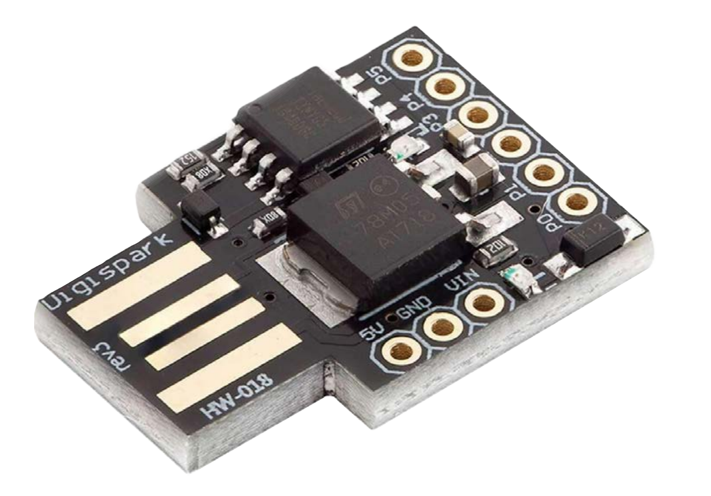

# ATTiny85 Ducky

### A Cheap "Disposable" Alternative to the Hak5 USB RubberDucky

This [Platformio Project](https://docs.platformio.org/en/latest/projectconf/index.html) Repository utilizes the [ATTiny85 Digispark Rev.3 Kickstarter](https://www.az-delivery.de/en/products/digispark-board) as a USB RubberDucky-like device capable of executing pre-programmed keystroke injection attacks. It leverages the DigiKeyboard library and extends this with the an expanded library to simulate keyboard inputs using a wider range of keyboard layouts, allowing for versatile payload delivery.


# :warning: Disclaimer Warning :warning:
This project is intended for authorised security testing and educational purposes only. Unauthorized use of this device on systems without explicit permission is illegal and unethical. The author does NOT endorse and is NOT responsible for any misuse or damage caused by improper use of the code and examples in this project.

## :rotating_light: Only test/use your payloads in a safe and legal environment! :rotating_light:


# Getting Started

Clone this repository to your local machine.

```
git clone https://github.com/yourusername/attiny85_ducky.git

```


Open the included project workspace file `attiny85_ducky.code-workspace` in [Visual Studio Code](https://code.visualstudio.com/).

```
cd attiny85_ducky
code .vscode/attiny85_ducky.code-workspace
```

#### Setup Extensions Dependencies & Drivers
Install the [C/C++ Extension Pack](https://marketplace.visualstudio.com/items?itemName=ms-vscode.cpptools-extension-pack) and [PlatformIO IDE VS Code Extension](https://marketplace.visualstudio.com/items?itemName=platformio.platformio-ide) if you haven't already. (see: [PlatformIO Intsall Guide](https://platformio.org/install/ide?install=vscode)


During setup, drivers and required libraries will be automatically downloaded to the `.pio` directory in the project folder. however if there are any issue with driver installation, a copy of the bootloader drivers is provided in the `drivers/` folder as a backup option for manual installation. a README with instructions is also provided in the `drivers/` folder to guide you through the manual installation process if needed.


# DuckyScript for ATTiny85 Ducky

This tool now supports DuckyScript payloads that are automatically compiled into C++ code for the Digispark ATTiny85 Rev.3.

#### Uploading the Default Payload

It is recommended to try out the default payload first to check that everything is working. This is in the `src/main.cpp` file by default and opens the GitHub project URL in the default browser. this is that same payload provide in the `examples/DemoOpenProjectRepo/` directory. 

:exclamation: `Remember to set the correct keyboard layout.`


## How It Works

1. Create your payload in `payload.ducky` (required filename)
2. Optionally add `ATTACKMODE` command to spoof USB device identity
3. Run PlatformIO build - the payload is automatically compiled to `src/main.cpp`
4. Upload to your ATTiny85
5. Payload executes on device startup

## Quick Start: USB Spoofing

You can now configure USB device identity directly in your DuckyScript payload:

```duckyscript
REM Configure USB identity
ATTACKMODE HID VID_16c0 PID_27db MAN_DigiKey PROD_ATTiny85_Ducky SERIAL_1337

REM Your payload here
DELAY 3000
GUI r
STRINGLN notepad
```

**See [docs/ATTACKMODE.md](../docs/ATTACKMODE.md) for complete documentation.**

## Supported DuckyScript Commands

The ATTiny85 Ducky compiler supports a **subset** of the full DuckyScript 3.0 specification. Only commands compatible with the DigiKeyboard library and ATTiny85 hardware constraints are supported.

### ✅ Supported Commands

#### Comments
```
REM This is a comment
REM Comments are ignored by the compiler
```

#### Language Configuration
```
DUCKY_LANG US
DUCKY_LANG DE
DUCKY_LANG FR
```

Supported languages: `US`, `BE`, `BR`, `CA_FR`, `CH_DE`, `CH_FR`, `CZ`, `DE`, `DK`, `ES`, `FI`, `FR`, `GB`, `HR`, `IT`, `NO`, `PT`, `RU`, `SI`, `SK`, `SV`, `TR`

#### USB Device Configuration (ATTACKMODE)
```
REM Spoof USB device identity
ATTACKMODE HID VID_046d PID_c31e MAN_Logitech PROD_K120_Keyboard SERIAL_13370001

REM Parameters (all optional):
REM   VID_xxxx     - Vendor ID (hex)
REM   PID_xxxx     - Product ID (hex)
REM   MAN_xxx      - Manufacturer name
REM   PROD_xxx     - Product name
REM   SERIAL_xxx   - Serial number (hex)
```

**Note:** ATTACKMODE is parsed at build time and generates USB configuration. The ATTiny85 cannot change USB identity at runtime. See [docs/ATTACKMODE.md](../docs/ATTACKMODE.md) for details.

#### Constants (DEFINE)
```
DEFINE #SERVER example.com
DEFINE #WAIT 1000

STRING https://#SERVER
DELAY #WAIT
```

#### Delays
```
DELAY 1000          REM Wait 1000 milliseconds (1 second)
DELAY 500           REM Wait 500ms
```

**Note:** Minimum delay value is implementation-dependent. Use `DELAY 100` or higher for reliability.

#### String Injection
```
STRING Hello World                    REM Type text (no newline)
STRINGLN Hello World                  REM Type text with ENTER at end

STRING https://github.com/3mrgnc3/attiny85_ducky
STRINGLN The quick brown fox jumps over the lazy dog
```

**All strings are stored in PROGMEM** to save precious RAM on the ATTiny85 (512 bytes total).

#### Special Keys
```
ENTER               REM Press Enter/Return key
ESCAPE              REM Press Escape key
TAB                 REM Press Tab key
SPACE               REM Press Space bar

UPARROW             REM Press Up arrow
DOWNARROW           REM Press Down arrow
LEFTARROW           REM Press Left arrow
RIGHTARROW          REM Press Right arrow
```

#### Modifier Key Combinations
```
GUI r               REM Windows Key + R (Run dialog)
GUI d               REM Windows Key + D (Show desktop)

CTRL c              REM Control + C (Copy)
CTRL v              REM Control + V (Paste)
CTRL ALT t          REM Control + Alt + T (Terminal on Linux)
CTRL ALT DELETE     REM Control + Alt + Delete

ALT F4              REM Alt + F4 (Close window)
ALT TAB             REM Alt + Tab (Switch windows)

SHIFT TAB           REM Shift + Tab
```

**Available Modifiers:** `GUI`, `CTRL`, `ALT`, `SHIFT`

---


#### Building & Uploading the example Payload
In the PlatformIO toolbar, click the `build` button to ensure that the build works and does an auto-setup / download of the **digispark-tiny** and **DigiKeyboardMultilang** code to the `.pio` directory in the project.


**ONLY IF the build test says `SUCCESS`**, proceed to the upload to device step, else debug and retest until it is successfull!

IMPORTANT!: `Disconnect the DigiSpark ATTiny85 device`, then without anything plugged in, **click** the `upload` button in the PlatformIO toolbar. 


On a successfull compilation, `you will have 60 seconds to connect the device` where its bootloader is listening for upload.


Unlike other PlatformIO projects, you must manually connect the DigiSpark ATTiny85 device **after** clicking the upload button, as the bootloader only listens for a short time after connection. This is because it uses the Micronucleus bootloader which has this limitation.

Micronucleus is different from typical USB bootloaders in that it only listens for a short period after the device is plugged in using its own dedicated interface available when the correct drivers are installed. No Serial interface is available during this time and the Micronucleus driver does not create a COM port like other bootloaders.

This means you need to connect the device within 60 seconds after clicking the upload button in PlatformIO.


Once uploaded, the device will execute the pre-programmed payload when plugged into a target machine. The default provided and all the example payloads are designed for Windows systems and will pause for 6 seconds to allow the OS to recognize the device and auto-install any required drivers before executing the payload. If you don'y want to execute the payload immediately, you simply need to unplug it within 6 secomd of the RED LED lighting up.

## Customization


Check out the `WiFiCredsDemo` or `AddRDPAdminAccount` for two example of execution in a administrator context in powershell with minimal user interaction to bypass UAC.

-----
## Simple Example Payload to execute a ScattRoll URL on Windows:

Modify the `ducky_scripts\payload.ducky` file as follows:

```ducky
REM ======================================
REM Title: ScattRoll - YouTube Auto-Fullscreen
REM Author: 3mrgnc3
REM Target: Windows 10/11 with chrome based default browser
REM ======================================

REM Configure USB device identity (processed before compilation)
ATTACKMODE HID VID_16c0 PID_27db MAN_DigiKey PROD_ATTiny85_Ducky SERIAL_1337

DUCKY_LANG US
DEFINE #HID_DELAY 1200

REM Wait 6 seconds for OS to recognize device and install drivers
DELAY 6000

REM Open Run dialog (Win+R)
GUI r
DELAY #HID_DELAY

REM Open ScattRoll URL
STRINGLN https://youtu.be/Hy8kmNEo1i8

REM Press 'f' for YouTube fullscreen after 4 seconds
DELAY 4000
STRINGLN f

```

Detailed Payload Explanations and Syntax can be found in the [Wiki](https://github.com/3mrgnc3/attiny85_ducky/wiki) page.


Else, further inspiration for creating your payloads can be found by alternatively checking out the preexisting ones made available already by [**CedArctic** in the **DigiSpark-Scripts** repo](https://github.com/CedArctic/DigiSpark-Scripts). 


## Supported Keyboard Layouts

This project supports **31 international keyboard layouts** through the DigiKeyboardMultilang library and the ExtendedLanguages library extension.

- `lang_be` - BE Belgian
- `lang_bg` - BG Bulgarian
- `lang_br` - BR Brazilian Portuguese
- `lang_ca` - CA Catalan
- `lang_ch` - CH Swiss German
- `lang_cs` - CS Czech
- `lang_csq` - CSQ Czech
- `lang_de` - DE German
- `lang_dk` - DK Danish
- `lang_es` - ES Spanish
- `lang_fi` - FI Finnish
- `lang_fr` - FR French
- `lang_gb` - UK English
- `lang_gr` - GR Greek
- `lang_hr` - HR Croatian
- `lang_hu` - HU Hungarian
- `lang_it` - IT Italian
- `lang_mx` - MX Mexican Spanish
- `lang_nl` - NL Dutch
- `lang_no` - NO Norwegian
- `lang_pl` - PL Polish
- `lang_pt` - PT Portuguese
- `lang_ro` - RO Romanian
- `lang_ru` - RU Russian ЙЦУКЕН
- `lang_se` - SE Swedish
- `lang_si` - SI Slovenian
- `lang_sk` - SK Slovak
- `lang_tr` - TR Turkish
- `lang_ua` - UA Ukrainian
- `lang_us` - US English

**Note:** All layouts support ASCII characters 32-126 (95 printable characters) with proper modifier keys (Shift, AltGr). For detailed information about each layout, see the [ExtendedLanguages README](lib/ExtendedLanguages/README.md).

----

## Some Useful Links that provide inspiration and resources for this project
- [NULLByte - How to Run USB Rubber Ducky Scripts](https://null-byte.wonderhowto.com/how-to/run-usb-rubber-ducky-scripts-super-inexpensive-digispark-board-0198484/) 
- [AZ-Delivery ATTiny85 Digispark Rev.3 Kickstarter Board](https://www.az-delivery.de/en/products/digispark-board)
- [DigiKeyboardMultilang Library by josefkuchar](https://github.com/josefkuchar/DigiKeyboardMultilang)
- [CedArctic - DigiSpark-Scripts Repository](https://github.com/CedArctic/DigiSpark-Scripts)
- [Digistump Wiki](https://web.archive.org/web/20240229063724/https://digistump.com/wiki/digispark/tutorials/connecting)
- [PlatformIO Documentation](https://docs.platformio.org/)


## Enjoy & Have Fun 


