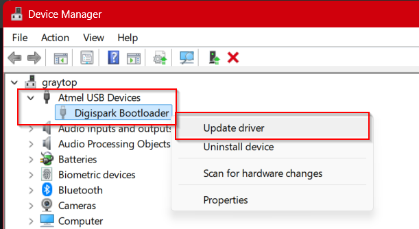

# Digistump Arduino Release 1.6.7

This `DigistumpDrivers.zip` file contains the Original Release 1.6.7 Driver Files from https://github.com/digistump/DigistumpArduino/releases

## Driver Installation Instructions (Windows)

PlatformIO should automatically install the necessary drivers when you first connect the Digispark ATTiny85 device. However, if you need to manually install the drivers, follow these steps:

Extract the downloaded ZIP file to a temporary folder.

Insert your DigiSpark ATTiny85 device into a USB port.

open Device Manager (Windows) and locate the DigiSpark device (it may appear under "Other devices" or "Unknown devices").

Right-click on the DigiSpark device and select "Update driver".

Choose "Browse my computer for drivers".
Browse to the folder where you extracted the driver files and select it.
Click "Next" to install the driver.
Wait for the installation to complete. You should see a message indicating that the driver was installed successfully

## Verification
the Red LED on a new DigiSpark board should blink every second when plugged in, indicating it is powered and recognized by the system.

to fully test the driver installation, follow the build and upload instructions in the main README.md to upload a test payload to the device.

